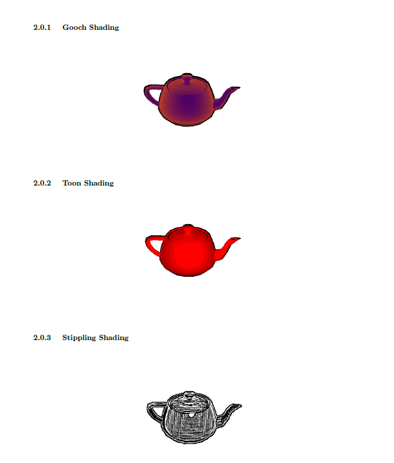

# NPR_Shading
Non Photorealistic  Shading in OpenGL- Cel, Gooch and Stipling \

## Overview

Non-photorealistic rendering is a very broad term in computer graphics. It covers all rendering techniques and visual styles that are obviously and deliberately different from the photorealstic appearance of physical objects. In this project I aim to implement a number of most widely used NPR shading modesls- Cel/Toon shading, Gooch Shading and stipling shading. When implementing one or more shaders for any specific visual style, one should first determine which features ofthe style have to be implemented. This is mainly a task of precise analysis of the visual style and a certain degree of the understanding of the shader language and its capablities.

The Vertex Shader Files are named as follows: VS_\<Shading Technique\>.txt
  
The Fragment Shader Files are named as follows: FS_\<Shading Technique\>.txt

## Sample Output

A sample output of the implementation can also be found in the file ./Docs/NPR.pptx
